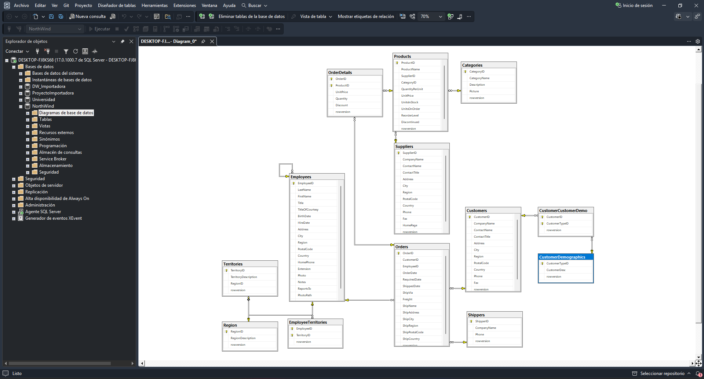
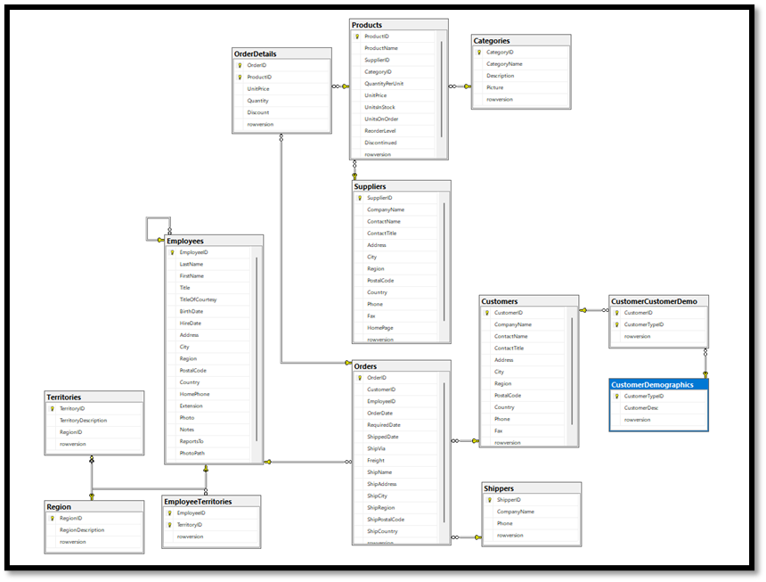

Proyecto Data Warehouse basado en Northwind (OLTP → DW → ETL)
1.	Descripción del trabajo
Este proyecto implementa un sistema completo de Data Warehouse (DW) basado en la base de datos transaccional Northwind (OLTP) utilizando SQL Server Management Studio.
Se realiza el proceso completo de integración de datos:
-	OLTP (sistema operativo): Northwind 
-	ETL (Extract, Transform, Load): Proceso de extracción y transformación de datos.
-	Data Warehouse (DW): Modelo dimensional orientado al análisis.
El objetivo es permitir el análisis eficiente de ventas mediante un esquema en estrella (Star Schema).
2.	Dominio del negocio
El dominio del negocio corresponde a una empresa de distribución y ventas de productos alimenticios y generales, donde se gestionan:
-	Clientes 
-	Productos 
-	Órdenes de compra 
-	Detalle de ventas 
-	Empleados 
-	Envíos 
El análisis se centra principalmente en ventas, clientes, productos y desempeño comercial.
3.	Tablas del OLTP (Northwind)
-	Customers: Contiene información de los clientes como nombre, ciudad, país y contacto.
-	Products: Contiene los productos disponibles, precios y stock.
-	Categories: Clasificación de productos por tipo.
-	Orders: Cabecera de las órdenes de compra realizadas por los clientes.
-	OrderDetails: Detalle de cada orden (producto, cantidad, precio, descuento).
-	Employees: Información de los empleados responsables de las ventas.
-	Shippers: Empresas encargadas del envío de productos.
-	Region / Territories: Estructura geográfica para clasificación de clientes y empleados.
 

 
4.	Tablas del Data Warehouse (DW)
 
 
Fact Table (Tablas Hechos)

Fact_Sales

Tabla central del modelo dimensional que almacena las métricas de negocio.
- OrderID 
- ProductID 
- CustomerID 
- EmployeeID 
- ShipperID 
- DateKey 
- Quantity 
- UnitPrice 
- Discount 
- Total

Dimension Tables (Tablas Dimension)

Dim_Customer
Información descriptiva del cliente:
- CustomerID 
- CompanyName 
- City 
- Country

Dim_Product

Información del producto:

- ProductID
- ProductName
- CategoryName 

Dim_Date

Dimensión de tiempo para análisis temporal:

- DateKey
- FullDate
- Year
- Month
- Day 

Dim_Employee

Información del empleado:

- EmployeeID 
- FullName 

Dim_Shipper

Información del transportista:

- ShipperID
- CompanyName

5.	Proceso ETL

El proceso ETL se realizó en tres etapas:
- Extracción:
Datos obtenidos desde la base OLTP Northwind.
- Transformación
Unión de tablas (ej. Products + Categories) 
- Formateo de fechas 
- Concatenación de campos (nombre completo empleado) 
- Carga
Inserción de datos en las tablas del Data Warehouse.

6.	Decisiones de diseño

- Uso de modelo en estrella (Star Schema)
- Implementación de clave de tiempo (DateKey)
- Total Venta = Cantidad×PrecioUnitario×(1−Descuento)
- Ventas por país= ∑(Cantidad×PrecioUnitario)

7. Resultado final
El sistema permite realizar análisis como:
-	Ventas por país 
-	Ventas por producto 
-	Ventas por fecha 
-	Rendimiento de empleados 
-	Análisis de envíos 
8.	Tecnologías utilizadas
-	SQL Server 
-	SQL Server Management Studio (SSMS) 
-	Modelo dimensional (Star Schema)

9. Instrucciones:

El proyecto incluye los archivos necesarios para recrear la arquitectura completa del sistema OLTP, el proceso ETL y el Data Warehouse.
-	OLTP.sql: contiene el script de creación de la base de datos transaccional Northwind (OLTP), incluyendo tablas, relaciones y restricciones. 
-	DW.sql: contiene la estructura del Data Warehouse, incluyendo tablas de dimensiones y tabla de hechos del modelo estrella. 
-	ETL.sql: contiene el proceso ETL encargado de extraer datos desde el OLTP, transformarlos y cargarlos al Data Warehouse. 
-	.dacpac: paquetes de despliegue de base de datos generados desde Visual Studio, utilizados para importar o publicar rápidamente la estructura de las bases de datos en otro entorno SQL Server. 
Orden recomendado de ejecución
  1.	Ejecutar OLTP.sql 
  2.	Ejecutar DW.sql 
  3.	Ejecutar ETL.sql 

Opcionalmente, los archivos .dacpac pueden importarse directamente utilizando SQL Server o Visual Studio para desplegar automáticamente la estructura de la base de datos de DW.

10. Conclusión
Este proyecto demuestra la transformación de un sistema OLTP normalizado a un Data Warehouse optimizado para análisis, aplicando procesos ETL y modelado dimensional para soporte de decisiones empresariales.
